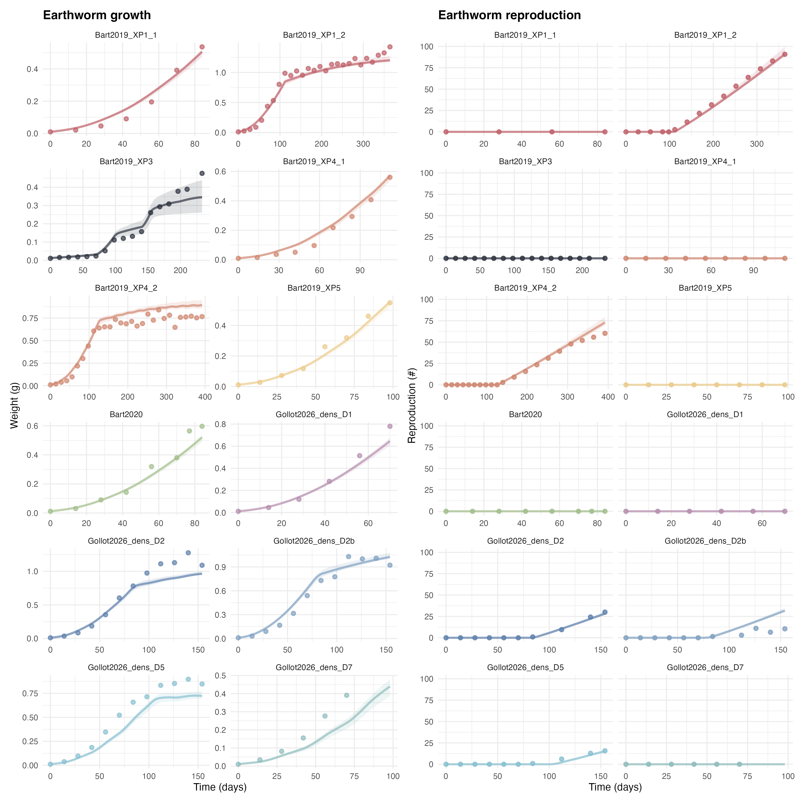
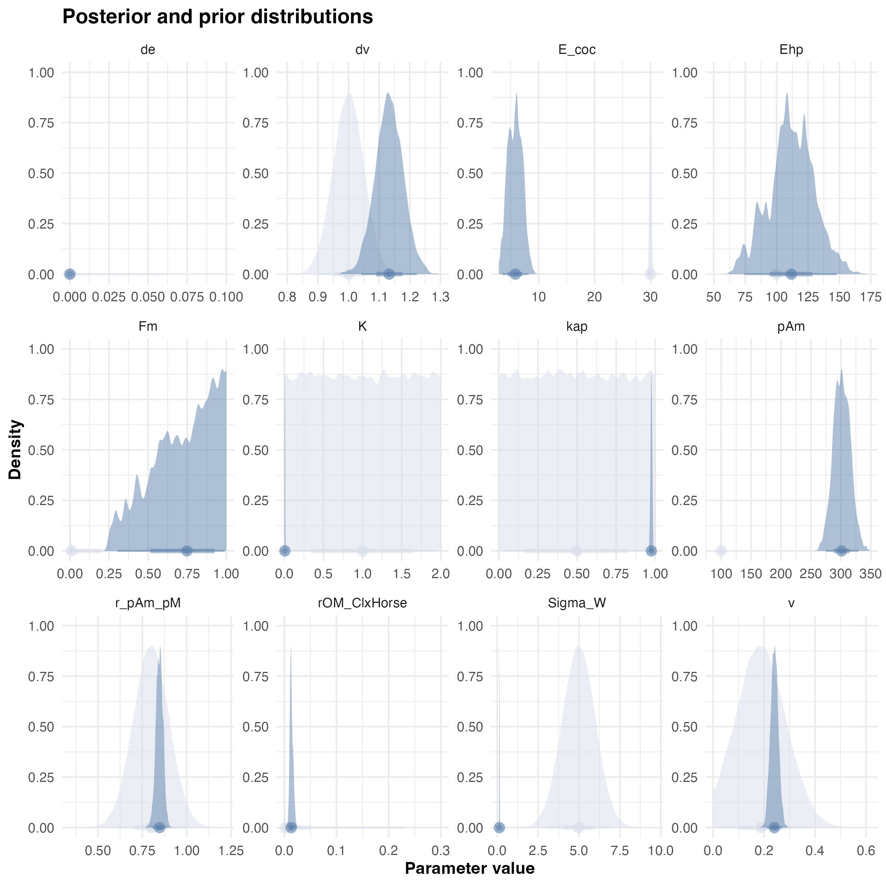
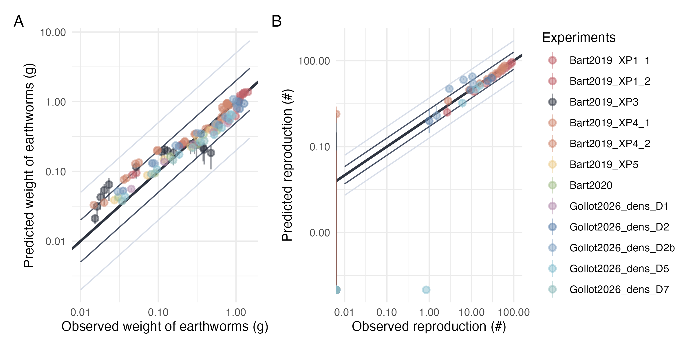
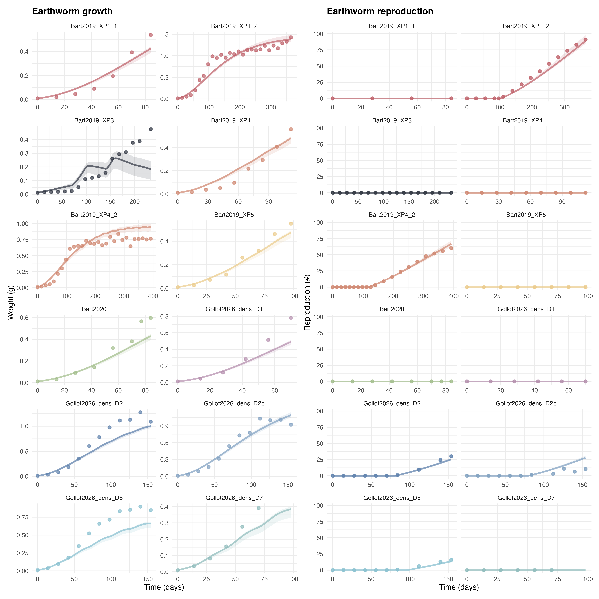
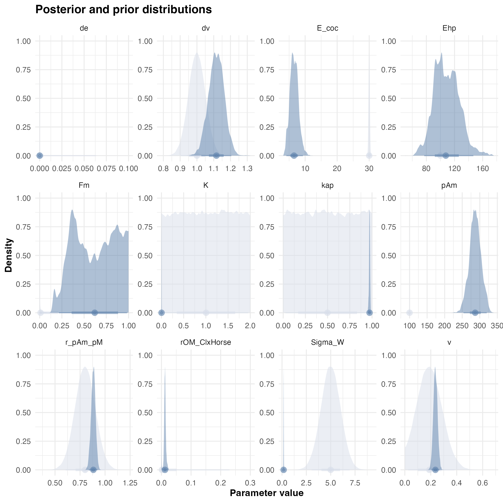
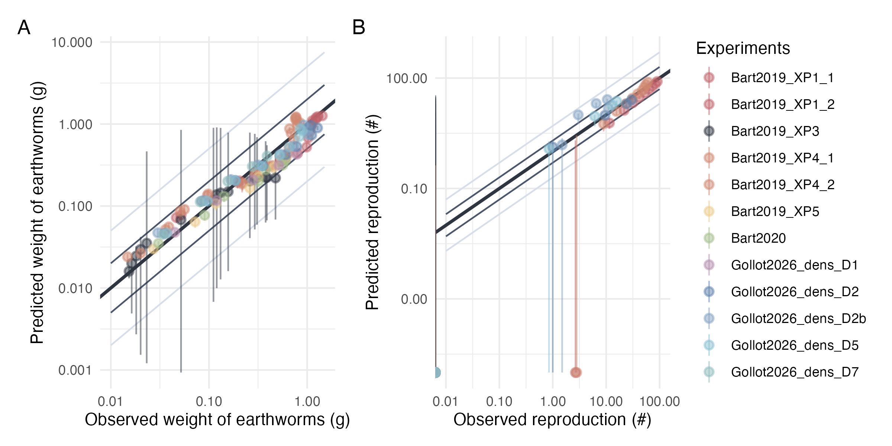
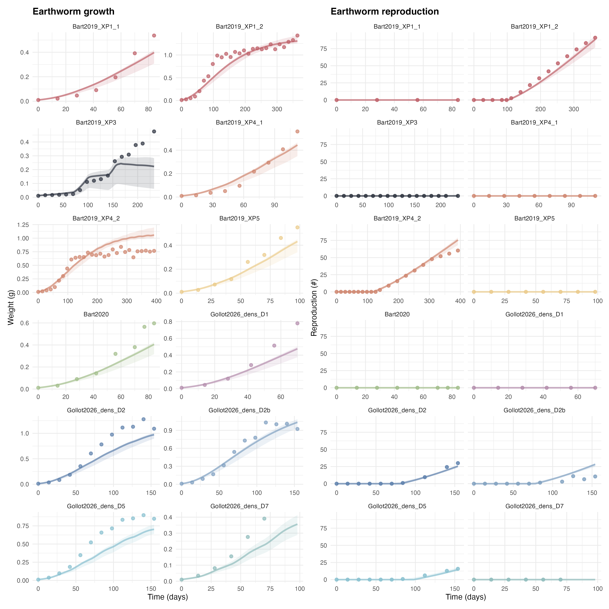

# Earthworm culture

## Breeding and experiment soil

The soil used in the culture of earthworms is collected from the top 10 cm of a meadow in Versailles called "Les Closeaux". It is then dried before being milled at \< 2 mm.

| Characteristics                 | Value |
|---------------------------------|-------|
| Clay ( \< 2 µm, g/kg)           | 226.0 |
| Fine silt (2-20 µm, g/kg)       | 174.1 |
| Coarse silt (20-50 µm, g/kg)    | 298.9 |
| Fine sand (50-200 µm, g/kg)     | 239.1 |
| Coarse sand (200-2000 µm, g/kg) | 47.9  |
| $CaCO_3$ total (g/kg)           | 23.3  |
| Organic matter (g/kg)           | 32.6  |
| $P_2O_5$ (g/kg)                 | 0.1   |
| Organic carbon (g/kg)           | 18.9  |
| Total nitrogen (N) (g/kg)       | 1.5   |
| C/N                             | 12.5  |
| pH                              | 7.5   |
| Total $Cu$ (mg/kg)              | 25.2  |

: Main characteristics of the breeding soil from Versailles. Table from @bart_2017. {@tbl-Clx}

## DNA barcoding

The phylogenetic tree was realised thanks to maximum likelyhood bootstrap method (1000 simulations) with the Tamura-Nei model (nucleotides). Bootstrap frequency is indicated on each branch.

*Aporrectodea caliginosa* is a cryptic species complex comprising three lineages. Our earthworm culture is known to include individuals from two closely related lineages (2 and 3). While these lineages could potentially exhibit differences in sensitivity, previous research on *Gammarus roeselii* has shown that tolerance within cryptic species complexes is not always lineage dependent [@kabus_2024].

# Models

## Model formulation

### Model state and intermediate variables

| Symbol | Description | Unit |
|:---|:---|:--:|
| **Environmental state variables** |  |  |
| $OM_{horse}$ | Horse dung organic matter mass | $\mathrm{g_{OM}}$ |
| $OM_{soil}$ | Soil organic matter mass | $\mathrm{g_{OM}}$ |
| $Soil_{w, cosm}$ | Dry mass of soil in the cosm | $\mathrm{g_{soil}}$ |
| **Organism state variables** |  |  |
| $E$ | Energy reserve | $\mathrm{J}$ |
| $E_h$ | Maturity | $\mathrm{J}$ |
| $L$ | Volumetric structural length | $\mathrm{cm}$ |
| $R$ | Cumulated reproduction | $\#$ |
| $W_w$ | Wet weight | $\mathrm{g}$ |
| **Intermediate variables** |  |  |
| $E_m$ | $\displaystyle \frac{\left\{\dot{p}_{Am}\right\}}{v}$ | $\mathrm{J.cm^{-1}}$ |
| $f$ | Scaled functional response | $-$ |
| $g$ | $\displaystyle \frac{[E_G]}{\kappa_{real} E_m}$ | $\mathrm{cm^{-2}}$ |
| $K_m$ | $\displaystyle \frac{\left[\dot{p}_M\right]_t}{[E_G]}$ | $\mathrm{d^{-1}}$ |
| $\kappa_{real}$ | Allocation fraction to soma | $-$ |
| $L_m$ | $\displaystyle \frac{v_t}{K_m g}$ | $\mathrm{cm}$ |
| $\dot{OM}_{out}^{horse}$ | Rate of consumption of horse dung organic matter | $\mathrm{g_{OM}.d^{-1}}$ |
| $\dot{OM}_{out}^{soil}$ | Rate of consumption of soil organic matter | $\mathrm{g_{OM}.d^{-1}}$ |
| $\dot{p}_C$ | Flux of mobilized energy from reserve | $\mathrm{J.d^{-1}}$ |
| $\dot{p}_R$ | Energy flux allocated to maturity / reproduction | $\mathrm{J.d^{-1}}$ |
| $\dot{Q}_{f,max}$ | Maximum rate of energy ingested | $\mathrm{J.d^{-1}}$ |
| $\dot{Q}_f^{matter}$ | Rate of matter ingestion | $\mathrm{J.d^{-1}}$ |
| $\dot{Q}_f^{horse}$ | Rate of energy ingested through horse dung | $\mathrm{J.d^{-1}}$ |
| $\dot{Q}_f^{soil}$ | Rate of energy ingested through soil | $\mathrm{J.d^{-1}}$ |

: Model state and intermediate variables.

### Standard DEB model

**Reserve energy dynamic**

$$
\frac{\mathrm{d}E}{\mathrm d t} = \frac{\{\dot p_{Am}\}_t}{L} \ \left(f - \frac{E\ \nu_t}{\{\dot p_{Am}\}_t}\right)
$$

\noindent with :

-   $E$ : Energy in the reserve ($J$)
-   $\nu_t$ : Energy conductance at temperature $T_{exp}$ ($cm.d^{-1}$)

**Growth**

$$
\begin{aligned}
\frac{\mathrm d L}{\mathrm d t} &= \frac{\nu_t}{3\ (\frac{E}{E_m} + g)} \left(\frac{E}{E_m} - \frac{L}{L_m}\right) \\ \\
K_m &= \frac{[\dot p_{M,t}]}{[E_G]} \\
E_m &= \frac{\{\dot p_{Am}\}_t}{\nu_t}\\
g &= \frac{[E_G]}{\kappa\ E_m}\\
L_m &= \frac{\nu_t}{K_m\ g}
\end{aligned}
$$

\noindent with :

-   $L$ : Structural volumetric length ($cm$)
-   $[\dot p_{M,t}]$ : Volume-specific maintenance rate ($J.d^{-1}.cm^{-3}$)
-   $[E_G]$ : Volume-specific cost for structure ($J.cm^{-3}$)
-   $\kappa$ : Energy allocation fraction to soma (-)

$$
W_W = L^3 \left(1+\frac{E}{E_m}w\right)
$$

\noindent with :

-   $W_W$ : Wet weight of the earthworm ($g$)
-   $w$ : Contribution of reserve to body weight ($g.cm^{-3}$)

**Maturity and reproduction**

$$
\dot p_C = \frac{g\ E}{g + \frac{E}{E_m}} (\nu_t\ L^2 + K_m\ L^3)
$$

\noindent with :

-   $\dot p_C$ : Mobilized energy flux from reserve ($J.d^{-1}$)

$$
\dot p_R = (1-\kappa)\ \dot p_C - \dot k_{J,t}\ E_h
$$

\noindent with :

-   $\dot p_R$ : Allocated energy flux to reproduction ($J.d^{-1}$)
-   $\dot k_{J,t}$ : Maturity maintenance rate ($d^{-1}$)

$$
\frac{\mathrm{d}E_H}{\mathrm{d}t}= 
\begin{cases}
E_H \leq E_H^p,\ & \dot{p}_R\\
E_H > E_H^p,\ & 0
\end{cases}
$$

\noindent with :

-   $E_h$ : Maturity ($J$)
-   $E_h^p$ : Maturity at puberty ($J$)

$$
\frac{\mathrm{d}R}{\mathrm{d}t}= 
\begin{cases}
E_H \leq E_H^p,\ & 0 \\
E_H > E_H^p,\ & \kappa_R\ \frac{\dot{p}_R}{E_{0}}
\end{cases}
$$

\noindent with :

-   $R$ : Cumulated reproduction (#)
-   $\kappa_R$ : Reproduction efficiency (-)
-   $E_0$ : Energy cost for an egg ($J$)

**Effect of temperature on rates**

$$
\begin{aligned}
s_A &= \exp(\frac{T_A}{T_{ref}-\frac{T_A}{T_{exp}+273.15}})\\
s_{rH} &= \frac{1 + \exp (\frac{T_A^H}{T^H}-\frac{T_A^H}{T_{ref}+ 273.15})}{1 + \exp (\frac{T_A^H}{T^H}-\frac{T_A^H}{T_{exp}+273.15})}\\
T_c &= 
\begin{cases}
\mathrm{if }\  T_{exp}+273.15 \geq T_{ref}, & s_A \\
\mathrm{if }\  T_{exp} + 273.15 < T_{ref}, & s_{rH}
\end{cases}\\ \\
\{\dot p_{Am}\}_t &= \{\dot p_{Am}\}\ T_c\\
[\dot p_{M,t}] &= [\dot p_{M}]\ T_c \\
\nu_t &= \nu \ T_c \\
\dot k_{J,t} &= \dot k_{J} \ T_c
\end{aligned}
$$

\noindent with :

-   $T_A$ : Arrhenius temperature (K)
-   $T_A^H$ : Arrhenius temperature for upper boundary (K)
-   $T^H$ : Upper boundary (K)
-   $T_{ref}$ : Reference temperature (K)
-   $T_{exp}$ : Experimental temperature (°C)

## Priors used

Priors are the same between models :

-   Distrib (Fm, LogUniform, 0.0001, 1);
-   Distrib (pAm, TruncNormal_cv, 100, 0.2, 40, 2000);
-   Distrib (r_pAm_pM, TruncNormal_cv, 0.8, 0.1, 0.1, 2);
-   Distrib (v, TruncNormal_cv, 0.18505, 0.1, 0.001, 2);
-   Distrib (kap, Uniform, 0, 1);
-   Distrib (kapJ, Uniform, 0, 1);
-   Distrib (kapA, Uniform, 0, 1);
-   Distrib (Ehp, TruncNormal_cv, 100, 0.2, 20, 300);
-   Distrib (E_coc, TruncNormal_cv, 30, 0.2, 1, 300);
-   Distrib (rOM_ClxHorse, LogUniform, 0.00001, 0.3);
-   Distrib (K, Uniform, 0.0001, 1);
-   Distrib (dv, TruncNormal_cv, 1, 0.05, 0, 4);
-   Distrib (wE, LogUniform, 1, 1000);
-   Distrib (de, LogUniform, 0.000000001, 0.1);
-   Distrib (tau, TruncNormal_cv, 7, 0.5, 0, 50);

Log-Likelihood calculations :

-   Distrib (Sigma_W, TruncNormal, 5, 1, 0.01, 100);
-   Likelihood (Weight, Normal, Prediction(Weight), Sigma_W);
-   Likelihood (Reproduction, Poisson, Prediction(Reproduction));

For the maximum ingestion rate, we imposed a biologically realistic constraint based on the assumption that an earthworm cannot ingest more than its own body weight per day. This constraint was used to bound the parameter $[\dot{F}_m]$.

An estimate of cocoon energy content was required to parameterize reproduction in the DEB model for *Aporrectodea caliginosa*. As no direct measurements are available for this species, we relied on published calorimetric data for *Lumbricidae* reported by @cumminns_1971, who measured the energy density of whole individuals across developmental stages. Reported mean energy densities were 5,690 cal.g$^{-1}$ dry weight ($n = 3$), corresponding to 19,098 J.g$^{-1}$, and 782 cal.g$^{-1}$ wet weight ($n = 1$), corresponding to 3,268 J.g$^{-1}$. Although these measurements do not specifically target cocoons, they provide a reasonable order-of-magnitude estimate for annelid biomass. Assuming a mean cocoon fresh mass of 10 mg, this yields an approximate energy content of 33 J per cocoon. Comparable values have been reported for soil invertebrates in other calorimetric studies (e.g., @driver_1974; @eggleton_2004), supporting the use of this approximation as a prior for egg energy content.

## Model A_FLYw

 {fig-scap="Estimated posterior distributions for each parameter."}

## Model B_FLYe

{fig-scap="Estimated posterior distributions for each parameter."}

## Model C_CWYe

{fig-scap="Estimated posterior distributions for each parameter."}

## Model D_CWKe

{fig-scap="Estimated posterior distributions for each parameter."}

## Model E_CLYe

{fig-scap="Estimated posterior distributions for each parameter."}

## Model F_CLKe

{fig-scap="Estimated posterior distributions for each parameter."}

## Model G_FLKe

{fig-scap="Estimated posterior distributions for each parameter."}

## Model H_FWKe

{fig-scap="Estimated posterior distributions for each parameter."}

::: landscape
## Summary

| Parameter | A_FLYw | B_FLYe | C_CWYe | D_CWKe | E_CLYe | F_CLKe | G_FLKe | H_FWKe |
|----|----|----|----|----|----|----|----|----|
| $\{\dot p_{Am}\}$ | 65.7 \newline [56.2 ; 104.8] | 40.0 \newline [40.0 ; 40.9] | 145.6 \newline [120.5 ; 179.4] | 274.5 \newline [245.7 ; 287.1] | 155.0 \newline [109.8 ; 171.0] | 256.9 \newline [229.9 ; 268.7] | 302.5 \newline [274.4 ; 329.2] | 281.3 \newline [253.5 ; 319.8] |
| $[\dot{p}_M]/\{\dot p_{Am}\}$ ratio | 0.94 \newline [0.79 ; 1.10] | 0.10 \newline [0.10 ; 0.14] | 0.75 \newline [0.63 ; 0.91] | 0.61 \newline [0.53 ; 0.66] | 0.75 \newline [0.63 ; 0.93] | 0.57 \newline [0.47 ; 0.59] | 0.84 \newline [0.81 ; 0.88] | 0.89 \newline [0.84 ; 0.92] |
| $\{\dot{F}_m\}$ or $[\dot{F}_m]$ | 0.99 \newline [0.89 ; 1.00] | 1.00 \newline [0.99 ; 1.00] | 0.00012 \newline [0.00014 ; 0.91] | 0.78 \newline [0.28 ; 0.99] | 0.00021 \newline [0.00028 ; 0.99] | 0.87 \newline [0.42 ; 0.99] | 0.35 \newline [0.30 ; 0.99] | 0.55 \newline [0.22 ; 0.98] |
| $r_{OM}$ | 0.300 \newline [0.266 ; 0.300] | 0.071 \newline [0.052 ; 0.093] | 0.00049 \newline [0.00025 ; 0.249] | 0.0195 \newline [0.0157 ; 0.0238] | 0.00018 \newline [0.00003 ; 0.270] | 0.0140 \newline [0.0114 ; 0.0183] | 0.0126 \newline [0.0081 ; 0.0206] | 0.0119 \newline [0.0029 ; 0.0197] |
| $K$ | NA | NA | NA | 0.0087 \newline [0.0033 ; 0.0125] | NA | 0.0154 \newline [0.0075 ; 0.0207] | 0.0034 \newline [0.0027 ; 0.0110] | 0.0022 \newline [0.00087 ; 0.0051] |
| $v$ | 0.183 \newline [0.149 ; 0.221] | 0.178 \newline [0.149 ; 0.222] | 0.0010 \newline [0.0010 ; 0.0012] | 0.245 \newline [0.212 ; 0.270] | 0.0010 \newline [0.0010 ; 0.0012] | 0.239 \newline [0.203 ; 0.262] | 0.232 \newline [0.211 ; 0.271] | 0.226 \newline [0.205 ; 0.267] |
| $\kappa$ | 0.94 \newline [0.84 ; 1.00] | 0.17 \newline [0.05 ; 0.25] | NA | NA | NA | NA | 0.97 \newline [0.96 ; 0.98] | 0.97 \newline [0.96 ; 0.98] |
| $\kappa_J$ | NA | NA | 0.81 \newline [0.73 ; 0.83] | 0.98 \newline [0.97 ; 0.99] | 0.80 \newline [0.71 ; 0.83] | 0.98 \newline [0.97 ; 0.98] | NA | NA |
| $\kappa_A$ | NA | NA | 0.20 \newline [0.11 ; 0.26] | 0.65 \newline [0.57 ; 0.69] | 0.16 \newline [0.11 ; 0.24] | 0.65 \newline [0.54 ; 0.67] | NA | NA |
| $\tau$ | NA | NA | 13.3 \newline [9.6 ; 21.7] | 11.5 \newline [5.6 ; 19.3] | 14.6 \newline [9.3 ; 21.5] | 13.0 \newline [7.3 ; 20.0] | NA | NA |
| $E_h^p$ | 107.3 \newline [60.8 ; 138.8] | 30.4 \newline [27.3 ; 34.9] | 20.9 \newline [20.1 ; 30.7] | 90.9 \newline [54.6 ; 123.4] | 21.8 \newline [20.1 ; 34.6] | 88.6 \newline [63.3 ; 122.5] | 111.4 \newline [74.2 ; 147.8] | 110.5 \newline [76.9 ; 146.8] |
| $E_{coc}$ | 30.0 \newline [18.6 ; 41.8] | 1.0 \newline [1.0 ; 1.0] | 5.9 \newline [4.3 ; 8.7] | 66.6 \newline [58.5 ; 75.1] | 7.1 \newline [4.3 ; 8.7] | 60.4 \newline [55.6 ; 70.9] | 6.3 \newline [3.5 ; 8.2] | 6.6 \newline [4.1 ; 9.3] |
| $d_V$ | 0.99 \newline [0.90 ; 1.10] | 0.67 \newline [0.58 ; 0.75] | 0.92 \newline [0.86 ; 1.06] | 1.24 \newline [1.16 ; 1.33] | 0.99 \newline [0.86 ; 1.06] | 1.23 \newline [1.14 ; 1.31] | 1.15 \newline [1.04 ; 1.22] | 1.12 \newline [1.03 ; 1.20] |
| $d_E$ | NA | 1.10e-09 \newline [1.13e-09 ; 7.84e-07] | 1.13e-09 \newline [1.04e-09 ; 1.23e-08] | 1.13e-09 \newline [1.13e-09 ; 6.15e-07] | 1.01e-09 \newline [1.04e-09 ; 1.57e-08] | 1.01e-09 \newline [1.18e-09 ; 1.12e-06] | 1.31e-09 \newline [1.18e-09 ; 8.64e-07] | 1.10e-09 \newline [1.22e-09 ; 8.41e-07] |
| $w_E$ | 717.5 \newline [572.4 ; 989.6] | NA | NA | NA | NA | NA | NA | NA |
| $\sigma_W$ | 0.33 \newline [0.29 ; 0.37] | 0.62 \newline [0.56 ; 0.70] | 0.63 \newline [0.56 ; 0.70] | 0.085 \newline [0.077 ; 0.101] | 0.60 \newline [0.56 ; 0.70] | 0.079 \newline [0.070 ; 0.090] | 0.13 \newline [0.11 ; 0.16] | 0.16 \newline [0.14 ; 0.20] |
| Log-likelihood | -15758.95 | -433.65 | -272.6 | 23.49 | -272.01 | 39.6 | -17.32 | -61.96 |
| BIC | 31574.14 | 923.53 | 612.69 | 26.14 | 611.5 | -6.09 | 96.5 | 185.79 |

: Estimate summary of each models and their respective log-likelihood and BIC.
:::

# Isolated adults

![Observed and predicted growth trajectories for isolated adults simulated with the retained model (CWKe) under formulations with either a constant juvenile allocation fraction ($\kappa_J$, light blue lines) or a transition toward an adult allocation fraction ($\kappa_A$, dark blue lines). Solid lines correspond to estimated model trajectories with transparent ribbons corresponding to the 95% credibilitty intervals. Transparent points represent observations from the juvenile stage, whereas filled points represent observations from the adult stage.](../../fig/DEB_Models/Y_IsolatedAdults_trajW.png){fig-scap="Observed and predicted growth trajectories for isolated adults simulated with the retained model (CWKe) under formulations with either a constant juvenile allocation fraction ($\\kappa_J$, light blue lines) or a transition toward an adult allocation fraction ($\\kappa_A$, dark blue lines)."}

![Observed and predicted reproduction trajectories for isolated adults simulated with the retained model (CWKe) under formulations with either a constant juvenile allocation fraction ($\kappa_J$, light blue lines) or a transition toward an adult allocation fraction ($\kappa_A$, dark blue lines). Solid lines correspond to estimated model trajectories with transparent ribbons corresponding to the 95% credibilitty intervals. Transparent points represent observations from the juvenile stage, whereas filled points represent observations from the adult stage.](../../fig/DEB_Models/Y_IsolatedAdults_trajR.png){fig-scap="Observed and predicted reproduction trajectories for isolated adults simulated with the retained model (CWKe) under formulations with either a constant juvenile allocation fraction ($\\kappa_J$, light blue lines) or a transition toward an adult allocation fraction ($\\kappa_A$, dark blue lines)."}
